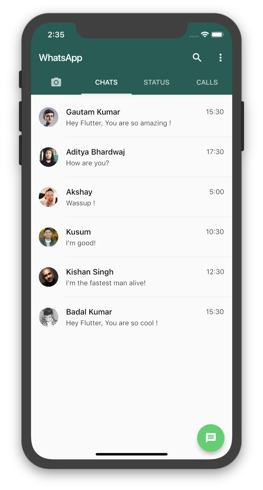
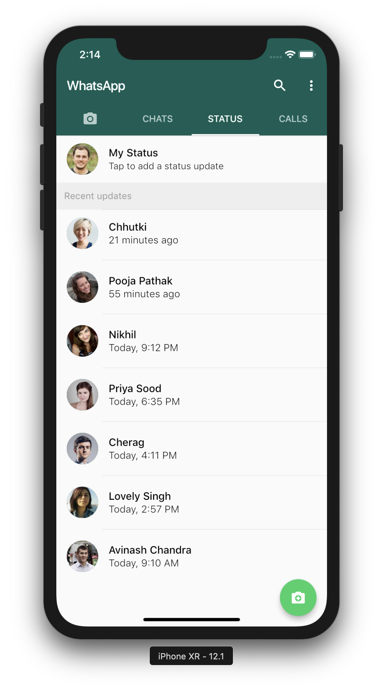
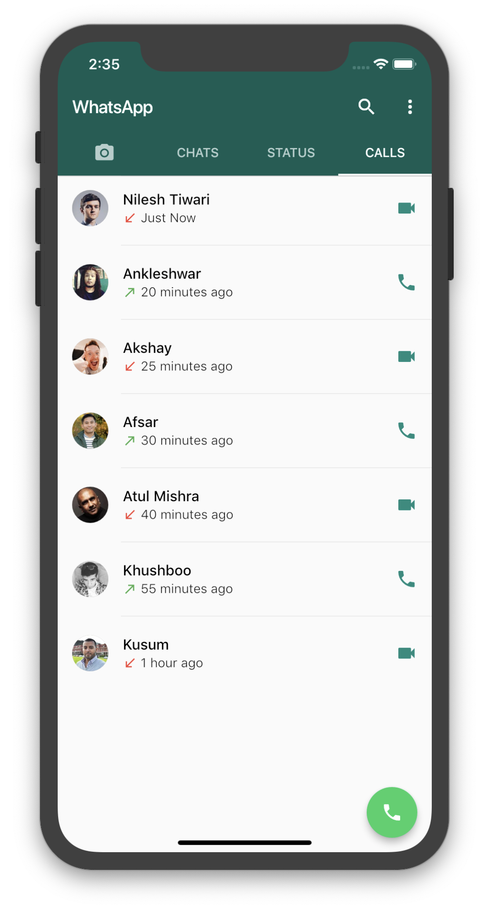
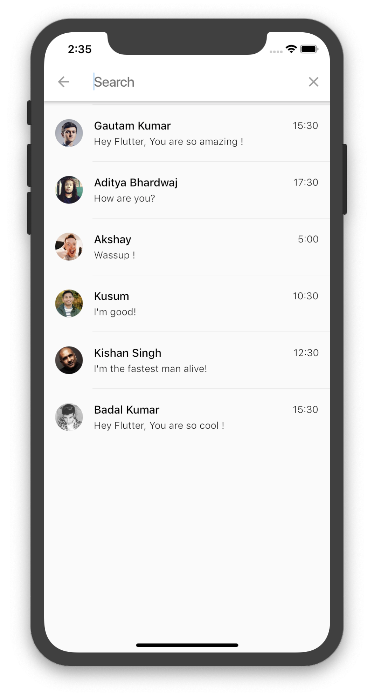
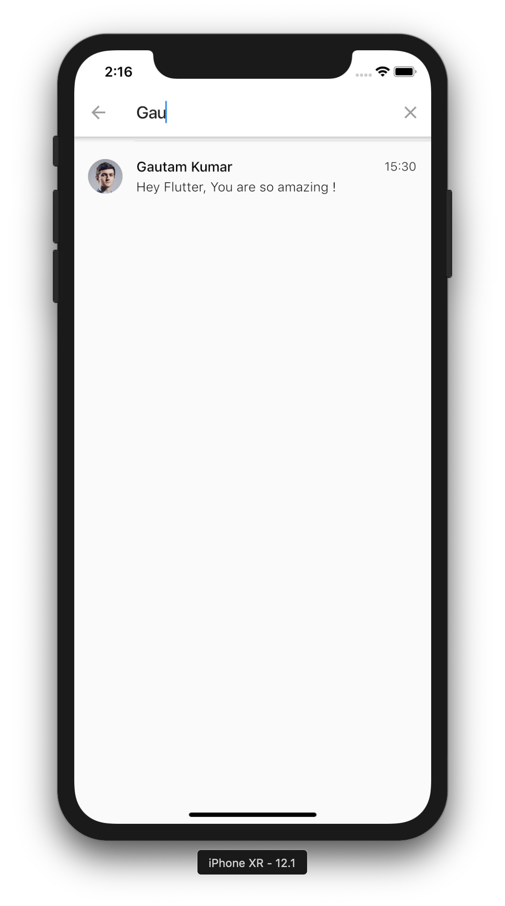
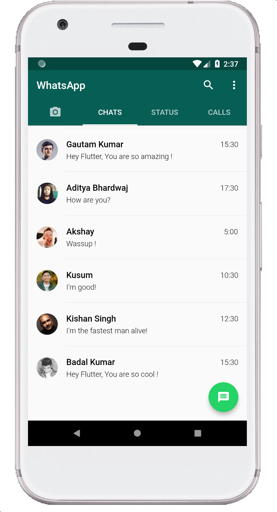
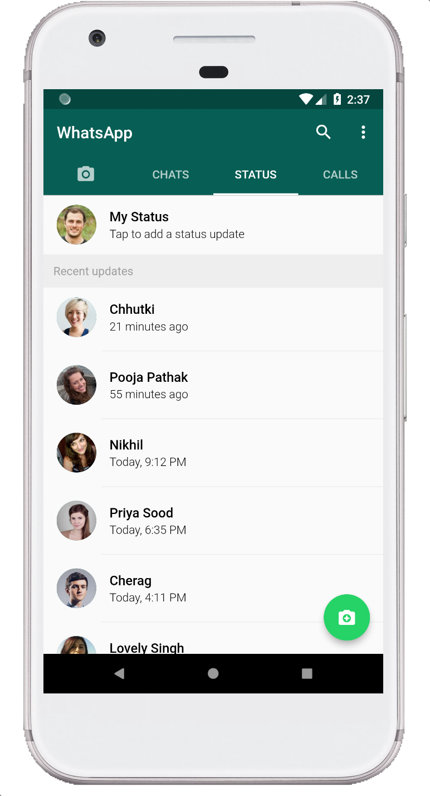
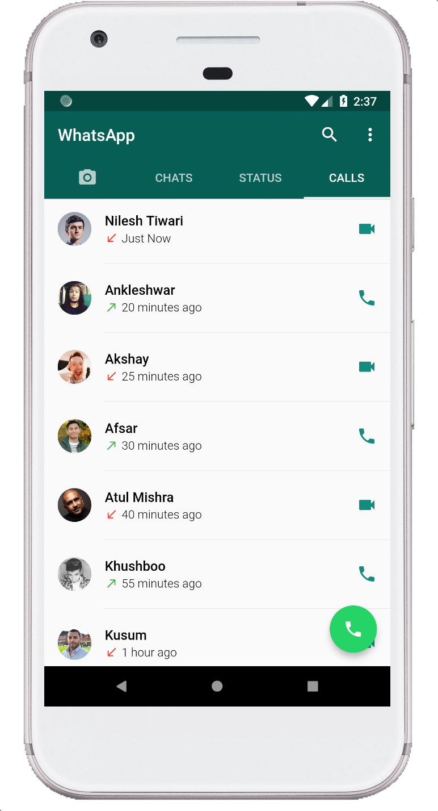
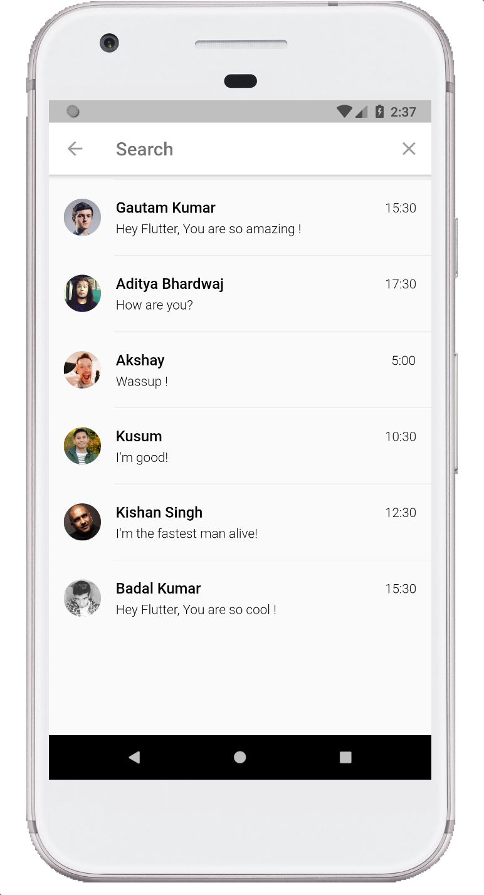

# WhatsAppClone Flutter

Building a WhatsApp UI Clone in Flutter.

### Show some :heart: and star the repo to support the project

### IOS Screenshots
    

### Android Screenshots
     

### Created & Maintained By

[Gautam Kumar](https://github.com/gssinghgautam)
([Instagram](https://www.instagram.com/kunwar_gautam))

> If you found this project helpful or you learned something from the source code and want to thank me, consider buying me a cup of :coffee:
>
> * [PayPal](https://www.paypal.me/unikgamer/)

## Features to come
    1. Firebase Phone Auth
    2. One To One Chat with Firebase
    3. Image support in Chat
    4. Video Support in Chat
    5. Documents Support in Chat
    

## Getting Started

**Note:** Make sure your Flutter environment is setup.

#### Installation

In the command terminal, run the following commands:

    $ git clone https://github.com/gssinghgautam/whatsapp_clone_flutter.git
    $ cd whatsapp_clone_flutter/
    $ flutter run

# Simulate for iOS
#### Method One
    
    Open the project in Xcode from ios/Runner.xcodeproj.
    Hit the play button.

#### Method Two

    Run the following command in your terminal.
    $ open -a Simulator
    $ flutter run

# Simulate for Android

    Make sure you have an Android emulator installed and running.
    Run the following command in your terminal.
    $ flutter run
    
# Simulate on Android and Ios at the same time
  
    Make sure you have an Android emulator and IOS simulator is running.
    Run the following command in your terminal.
    $ flutter run -d all

# License

    MIT License

    Copyright (c) 2019 Gautam Kumar

    Permission is hereby granted, free of charge, to any person obtaining a copy
    of this software and associated documentation files (the "Software"), to deal
    in the Software without restriction, including without limitation the rights
    to use, copy, modify, merge, publish, distribute, sublicense, and/or sell
    copies of the Software, and to permit persons to whom the Software is
    furnished to do so, subject to the following conditions:

    The above copyright notice and this permission notice shall be included in all
    copies or substantial portions of the Software.

    THE SOFTWARE IS PROVIDED "AS IS", WITHOUT WARRANTY OF ANY KIND, EXPRESS OR
    IMPLIED, INCLUDING BUT NOT LIMITED TO THE WARRANTIES OF MERCHANTABILITY,
    FITNESS FOR A PARTICULAR PURPOSE AND NONINFRINGEMENT. IN NO EVENT SHALL THE
    AUTHORS OR COPYRIGHT HOLDERS BE LIABLE FOR ANY CLAIM, DAMAGES OR OTHER
    LIABILITY, WHETHER IN AN ACTION OF CONTRACT, TORT OR OTHERWISE, ARISING FROM,
    OUT OF OR IN CONNECTION WITH THE SOFTWARE OR THE USE OR OTHER DEALINGS IN THE
    SOFTWARE.
    
For help getting started with Flutter, view our online
[documentation](https://flutter.io/).
